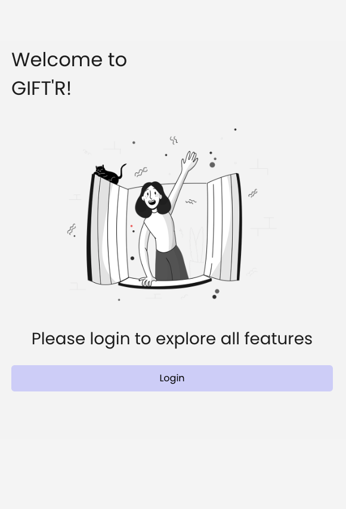
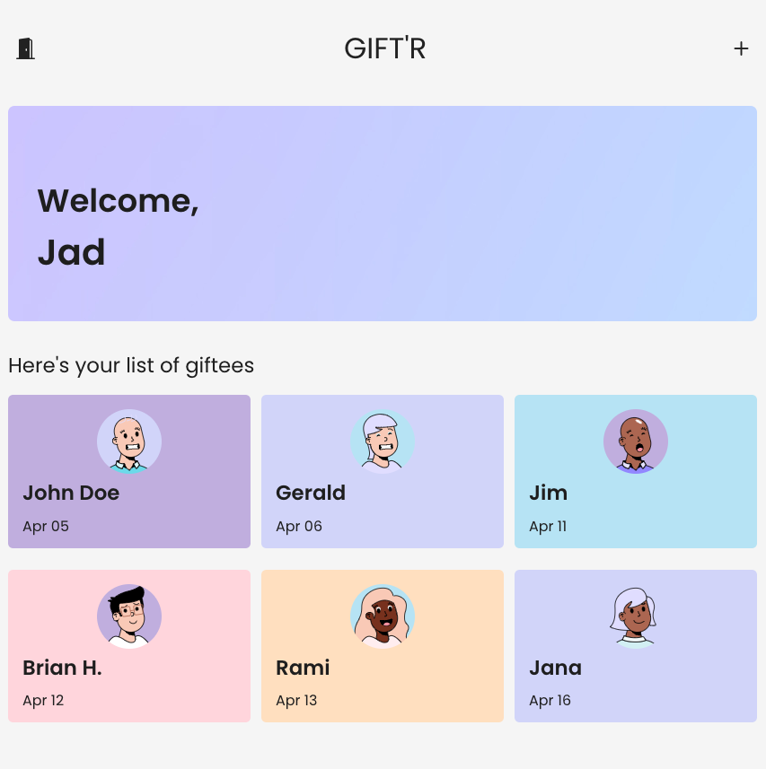
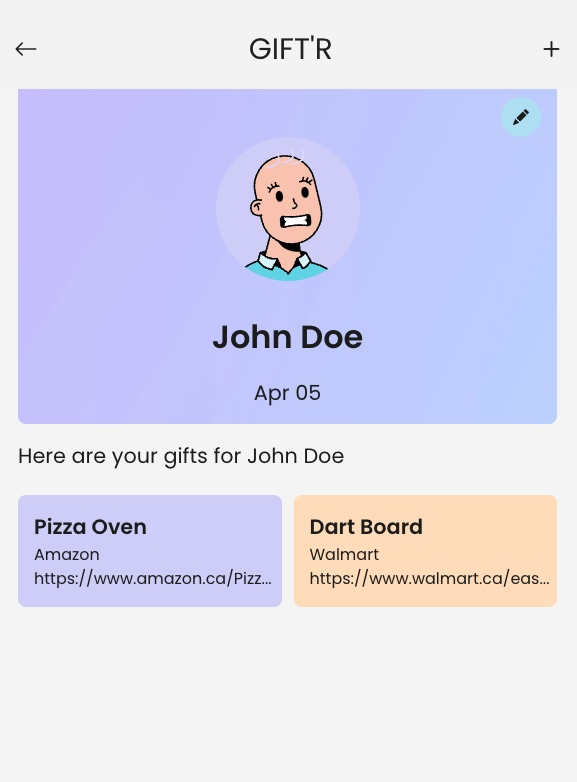

# Gift'r App Documentation

### Application Summary
Gift'r app is responsive, web-based React application designed to facilitate the organization and tracking of gift ideas for friends and loved ones. The front end of the application is hosted on Netlify. https://giftr-mj-jj.netlify.app/ 

The back end for Gift'r manages user accounts, people, and gift ideas. The REST API for the app is built using Node.js, Express, Mongoose, and MongoDB, and is hosted on Render.

<table>
  <tr>
    <td></td>
    <td></td>
    <td></td>
  </tr>
</table>

## Front End

### Components and Layout
The Gift'r app consists of several main components:

1. **Login/Logout**: Users can authenticate using Google OAuth, with authentication handled through the API and JWT tokens for session management.
   
2. **Home (People List)**: Displays a list of people for whom gift ideas are being collected. The list includes names and dates of birth sorted by month and day. Users can edit person details or navigate to the gift list for each person.

3. **Add/Edit Person**: Allows users to add new people or edit existing entries. Users can input name and date details, with options to save changes or delete existing entries.

4. **Gift List for One Person**: Shows all gift ideas associated with a selected person. Users can view and manage gift details, including edit and delete options.

5. **Add/Edit Gift Idea**: Enables users to add new gift ideas or modify existing entries. Includes fields for gift idea, store name, and URL, with options to save changes.

### Navigation
Navigation within the Gift'r app is facilitated using React Router and includes the following features:

- **Login/Logout Navigation**: The login page includes OAuth authentication and redirects users to the appropriate routes upon successful login. A logout button is available for authenticated users.
  
- **Header Navigation**: The fixed header bar at the top of the screen includes navigation controls based on the user's current route. It displays a back button on add/edit pages and a logout icon on the person list or gift list routes.
  
- **Icon Buttons**: Each person item in the list includes buttons to navigate to the edit person route or the gift list route. Gift items include a button to navigate to the edit gift route.

### Functionality
The Gift'r app incorporates several functional elements to enhance user experience and ensure data integrity:

- **URL Input Validation**: When entering a URL for a gift, the app automatically checks for "https://" at the start and adds it if needed.
  
- **Session Management**: User sessions are managed using JWT tokens stored in sessionStorage. Access to protected routes and API calls requires a valid token.
  
- **API Interaction**: All API requests are made using fetch calls within useEffect hooks. JWT tokens are included in the request headers for authentication.
  
- **Delete Confirmation**: Confirmation dialogs are implemented for all delete actions to prevent accidental data loss. Dialogs can be HTML modals, UI Kit modals, or native browser confirm methods.

## Back End

- **User Management**: Implements basic user authentication with Google OAuth and JWT. Includes routes for logging in, logging out, and user registration.
  
- **Middleware**: Utilizes middleware functions to streamline route handling and ensure code reusability.
  
- **Response Payload**: Responses from the API are formatted as JSON objects, including data or error properties as appropriate.
  
- **Schema Validation**: All user-supplied data is sanitized to prevent XSS and Query Injection attacks. Schema validation errors are caught and returned to the client with the correct status code and error message.

### Auth Routes
The authentication routes for the Gift'r app are exposed under the /auth route prefix and include the following actions:

- **Authenticate User**: Handles user authentication using Google OAuth and returns JWT tokens upon successful login.
  
- **Google Response**: Processes the Google OAuth response and redirects users to the appropriate route with the JWT token included in the query parameters.
  
- **Logout User**: Logs out the current user by deleting the JWT token from storage.

### API Routes
The primary application capabilities are grouped under the /api resource route prefix, requiring valid JWT tokens for authorization.

#### Person Routes

| Action              | Method | Resource Path    | Notes                                |
|---------------------|--------|------------------|--------------------------------------|
| List all people     | GET    | /api/people      | Gift ideas not populated             |
| Get details for a person | GET    | /api/people/:id | Gift ideas fully populated           |
| Create a person     | POST   | /api/people      |                                      |
| Replace a person    | PUT    | /api/people/:id |                                      |
| Update a person     | PATCH  | /api/people/:id |                                      |
| Remove a person     | DELETE | /api/people/:id |                                      |

#### Gift Routes

| Action              | Method | Resource Path               |
|---------------------|--------|-----------------------------|
| List all gifts      | GET    | /api/people/:id/gifts      |
| Get details for a gift | GET    | /api/people/:id/gifts/:giftId |
| Create a gift       | POST   | /api/people/:id/gifts      |
| Update a gift       | PATCH  | /api/people/:id/gifts/:giftId |
| Remove a gift       | DELETE | /api/people/:id/gifts/:giftId |

### Resource Schema

#### Person

| Property  | Type         | Required | Max (length/value) | Default   |
|-----------|--------------|----------|---------------------|-----------|
| name      | String       | true     |                     |           |
| dob       | Date         | true     |                     |           |
| ownerId   | ObjectId, ref: 'User' | true |                  | Current user |
| gifts     | [ Gift ]     |          |                     |           |
| createdAt | Date         |          |                     | Date.now()|
| updatedAt | Date         |          |                     | Date.now()|

#### Gift

| Property  | Type   | Required |
|-----------|--------|----------|
| txt       | String | true     |
| store     | String | true     |
| url       | String | true     |
| createdAt | Date   | handled by mongoose |
| updatedAt | Date   | handled by mongoose |

#### User

| Property  | Type   | Required | Default | Unique | Notes            |
|-----------|--------|----------|---------|--------|------------------|
| name      | String | true     |         |        | comes from Google|
| googleId  | String | true     |         | true   | comes from Google|
| createdAt | Date   | true     |         |        | handled by mongoose |
| updatedAt | Date   | true     |         |        | handled by mongoose |
